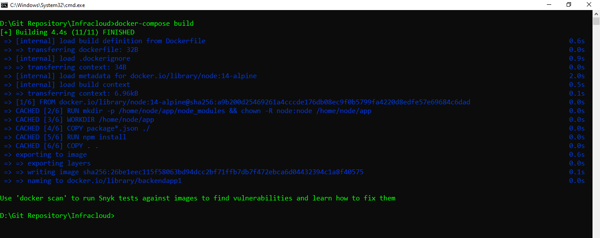
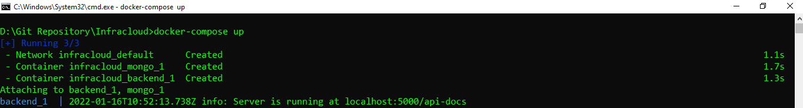
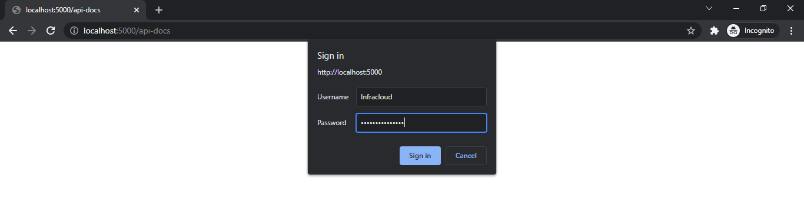
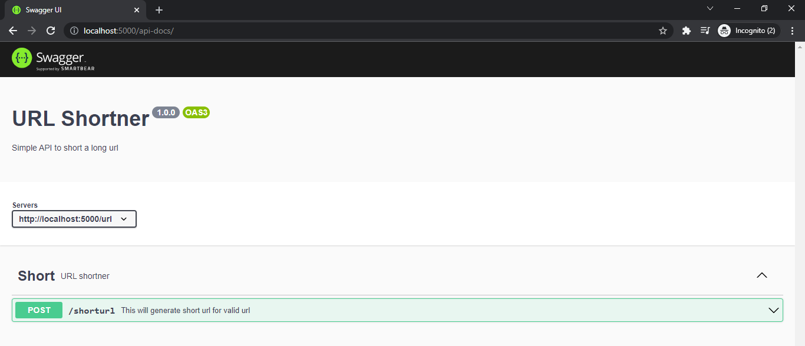

# Associate Software Engineer Assignment
[](https://www.infracloud.io/)
> Name --> Manoj Kumawat
> 
> Email --> imkumawatmanoj@gmail.com
> 
> Github --> https://github.com/imkumawat
> 
> Linkedin --> https://www.linkedin.com/in/imkumawat/
>
> Feel free to contact me!


# Swagger URL
- http://localhost:5000/api-docs/

# API Base URL
- http://localhost:5000/url
- http://localhost:5000/

# Functionality of APIs

- Create short url for a long url
- Redirect to original url by hitting the short url


# APIs Path

- /url/shorturl
- /shorturlcode


# Requirements

- Nodejs
- MongoDB 

# Running Server inside Docker
Make sure you have Dokcker installed in your system

Open terminal and clone this repository in your system

```sh
git clone https://github.com/imkumawat/Infracloud.git
```
Open terminal in cloned project directory

- Check status of Docker
```sh
docker
```

- Build docker image
```sh
docker-compose build
```

- Running docker image
```sh
docker-compose up
```



Now, open chrome browser and hit the swagger url

http://localhost:5000/api-docs/



# Login credentials
__Username:__ Infracloud

__Password:__ Infracloud@2022

# Swagger UI




# Using APIs
__APIs setted with default inputs__
- Click on any API
- Click on __Try it out__
- Click on __Execute__ 
- And observe the __Server Response__

# Running Server in local machine

Installing the dependencies and devDependencies

- Open termial in parent directory and hit below command to install packages
```sh
npm install
```

Checking status of MongoDB service

- Open terminal and hit below command

```sh
mongo
```
Editing **.env** file
- File **.env** contain the default **DataBaseConnection String** that works with **docker mongo image**
- To work with in local system
- Open **.env** file to edit and change the value of **DB_CONNECTION_STRING** to "mongodb://127.0.0.1/infracloud"
- Save it

Running the Server

- Hit the below command in the terminal

```sh
node src/server.js
```


Now, open chrome browser and hit the swagger url

http://localhost:5000/api-docs/
